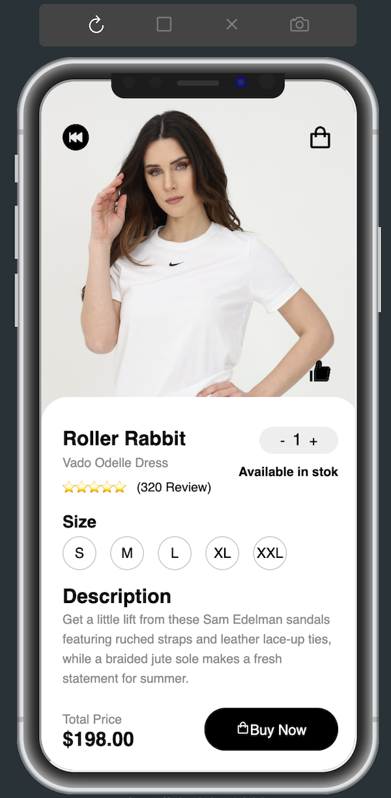

# Mobile Design Assignment

## React App - Local Setup Guide

This is a step-by-step guide on how to set up and run the React app locally on your machine. By following these instructions, you will have the app up and running in no time.

## Prerequisites

Before you begin, ensure that you have the following installed on your machine:

- [Node.js](https://nodejs.org) (version 14 or later)
- [npm](https://www.npmjs.com/) (Node Package Manager, usually installed with Node.js)
- Complete Additional requirement also. 

## Installation

1. Clone the repository to your local machine using Git:
   ```bash
   git clone https://github.com/hemantkumar00/MobileDesign.git
   
Alternatively, you can download the repository as a ZIP file and extract it to a local directory.

2. Navigate to the project's root directory:
   ```bash
   cs <project-directory>
   
3. Install the project dependencies using npm:
   ```bash
   npm install
     

## Running the App

Once you have completed the installation and configuration steps, you can start the React app locally:

1. In the project's root directory, start the development server: 
   ```bash
   npm start


2. The React app will be compiled and bundled, and a local development server will be started. You will see output in the terminal indicating that the app is running.

3. Open a web browser and visit `http://localhost:3000` to access the app.

## Additional Requirments

1. Install `Mobile View` Extension on VS Code.
2. The tab will pop up in left bar (Similar to mobile icon) open that.
3. Sellect `Use iPhone X` and write `http://localhost:3000` this url. 
4. Then one iPhone design will open inside VS Code 
5. Now you can use the Application.

## Images
  


## Conclusion

You have successfully set up the React app locally and should now be able to run it on your machine. Refer to the app's documentation or project maintainers for any specific instructions or additional steps required for customization or deployment.

Happy coding!


